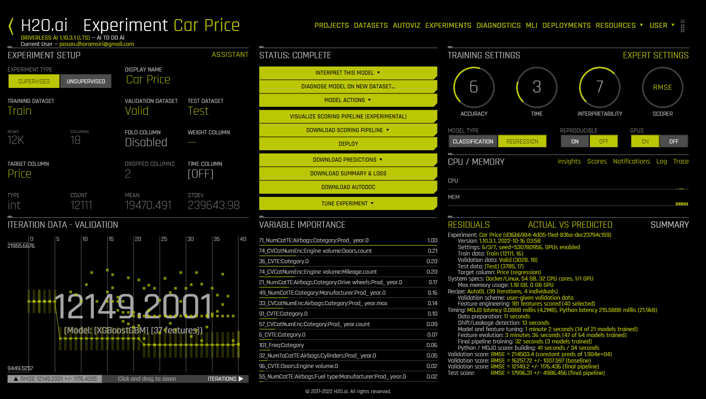
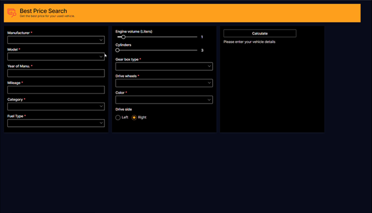

# H2O-Wave-App

## Car price prediction app using H2O Wave SDK

[car_price.ipynb](car_price.ipynb) is used preprocess the data from csv file.

After that using H2O Driverless AI analyzed the preprocess dataset and got the infomation of best fit model with parameters.

[car_price.ipynb](car_price.ipynb) also used the train the XGBoost Regression model to predict car price with given parameters.

**Using H2O Wave SDK graphical user application was developed with following features,**
1. Form with serveral widgets such as textbox, dropdown, sliders and choice group.
2. Popup window for the dropdowns which has large number of selections.
3. Form data validation on submit.
4. Error handling on submitting with empty data.

